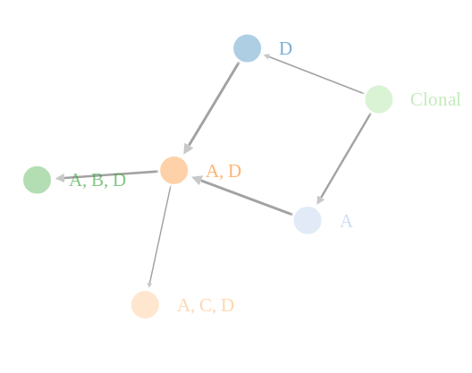
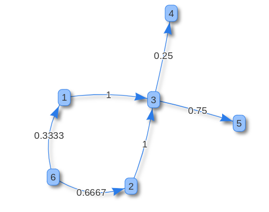

```{r style, echo = FALSE, results = 'asis'}
BiocStyle::markdown()
```

```{r, echo=F}
knitr::opts_chunk$set(echo = TRUE)
```

```{r, include = FALSE}
show.df <- function(df, w, h){
    df[1:h,1:w]
}
size.df <- function(df){
    paste("ncol:", ncol(df), " - nrow:", nrow(df))
}
```


# Introduction 

This document is a presentation of the R implementation of the tool [CIMICE](https://github.com/redsnic/tumorEvolutionWithMarkovChains).
It shows the main features of this software and how it is built as a modular pipeline, with the goal of making it easy to change and update.

CIMICE is a tool in the field of tumor phylogenetics and
its goal is to build a Markov Chain (called Cancer Progression Markov Chain, CPMC) in order to model tumor subtypes evolution.
The input of CIMICE is a Mutational Matrix, so a boolean matrix representing altered genes in a
collection of samples. These samples are assumed to be obtained with single-cell DNA analysis techniques and
the tool is specifically written to use the peculiarities of this data for the CMPC construction.

CIMICE data processing and analysis can be divided in four section:

* Input management
* Graph topology reconstruction
* Graph weight computation
* Output presentation

These steps will be presented in the following sections.

## Used libraries 

This implementation of CIMICE is built as a single library on its own:

```{r, error=F, message=F, results = "hide"}
library(CIMICE)
```

and it requires the following libraries: 

`r Biocpkg("IRanges")`

```{r, error=F, message=F, results = "hide"}
# Dataframe manipulation
library(dplyr) 
# Plot display
library(ggplot2)
# Improved string operations
library(glue)
# Dataframe manipulation
library(tidyr)
# Graph data management
library(igraph)
# Remove transitive edges on a graph
library(relations)
# Interactive graph visualization
library(networkD3)
# Interactive graph visualization
library(visNetwork)
# Correlation plot visualization
library(ggcorrplot)
# Functional R programming
library(purrr)
# Graph Visualization
library(ggraph)
```

# Input management

CIMICE requires a boolean dataframe as input, structured as follows:

* Each column represents a gene
* Each row represents a sample (or a genotype)
* Each 0/1 represents if a given gene is mutated in a given sample 

It is possible to load this information from a file. The default input format for CIMICE is the "CAPRI/CAPRESE" format:

* The file is a tab or space separated file
* The first line starts whith the string "s\\g" (or any other word) followed by the list of genes (or loci) to be considered in the analysis
* Each subsequent line starts with a sample identifier string, followed by the bit set representing its genotype 

This is a scheme of CIMICE's input format:

```
s\g       gene_1 gene_2 ... gene_n
sample_1    1      0    ...   0
...
sample_m    1      1    ...   1
```

and this an example on how to load a dataset from the file system:

```{r, results = 'hide'}
# Read input dataset in CAPRI/CAPRESE format
dataset.big <- read.CAPRI(system.file("extdata", "example.CAPRI", package = "CIMICE", mustWork = TRUE))
```
```{r, echo=F}
dataset.big %>% show.df(6,6) 
dataset.big %>% size.df()
```

Another option is to define directly the dataframe in R. This is made easy by the functions `make.dataset` and `update_df`, used as follows:

```{r}
# genes
dataset <- make.dataset(A,B,C,D) %>%
    # samples
    update_df("S1", 0, 0, 0, 1) %>%
    update_df("S2", 1, 0, 0, 0) %>%
    update_df("S3", 1, 0, 0, 0) %>%
    update_df("S4", 1, 0, 0, 1) %>%
    update_df("S5", 1, 1, 0, 1) %>%
    update_df("S6", 1, 1, 0, 1) %>%
    update_df("S7", 1, 0, 1, 1) %>%
    update_df("S8", 1, 1, 0, 1) 
```

with the following outcome:

```{r, echo=FALSE}
dataset
```

In the case your data is composed by samples with associated frequencies it is possible to use an alternative format
that we call "CAPRIpop":

```
s/g    gene_1 gene_2 ... gene_n freq
sample_1 1 0 ... 0 freq_s1
...
sample_m 1 1 ... 1 freq_sm
```

where the `freq` column is mandatory and sample must not be repeated. Frequencies
in the `freq` column will be automatically normalized. This format is meant
to be used with the functions `quick.run(dataset, mode="CAPRIpop")` for the
full analysis and `dataset.preprocessing.population(...)` for the preprocessing
stage only. The subsequent operations remain otherwise equal to those 
of the default format.

# Preliminary check of mutations distributions

This implementation of CIMICE includes simple functions to quickly analyze the distributions of mutations among genes and samples.

The following code displays an histogram showing the distribution of the number of mutations hitting a gene:

```{r}
gene.mutations.hist(dataset.big)
```

And this does the same but from the samples point of view:

```{r}
sample.mutations.hist(dataset.big, binwidth = 10)
```

## Simple procedures of feature selection

In case of huge dataset, it could be necessary to focus only on a subset of the input samples or genes.
The following procedures aim to provide an easy way to do so when the goal is to use the most (or least)
mutated samples or genes.

### By genes

Keeps the first $n$ (=100) most mutated genes: 

```{r, results = 'hide'}
select.genes.on.mutations(dataset.big, 100)
```
```{r, echo=FALSE}
temp <- select.genes.on.mutations(dataset.big, 100)
temp %>% show.df(6,6) 
temp %>% size.df()
```

### By samples

Keeps the first $n$ (=100) least mutated samples: 

```{r, results = 'hide'}
select.samples.on.mutations(dataset.big, 100, desc = FALSE)
```
```{r, echo=FALSE}
temp <- select.samples.on.mutations(dataset.big, 100, desc = FALSE)
temp %>% show.df(6,6) 
temp %>% size.df()
```

## Both selections

It is easy to combine these selections by using the pipe operator `%>%`:

```{r, results = 'hide'}
select.samples.on.mutations(dataset.big , 100, desc = FALSE) %>% select.genes.on.mutations(100)
```
```{r, echo=FALSE}
temp <- select.samples.on.mutations(dataset.big , 100, desc = FALSE) %>% select.genes.on.mutations(100)
temp %>% show.df(6,6) 
temp %>% size.df()
```

## Correlation plot

It may be of interest to show correlations among gene or sample mutations. The library `corrplots` provides an easy way to do so by preparing an 
heatmap based on the correlation matrix. We can show these plots by using the following comands:

gene mutations correlation:

```{r}
corrplot.genes(dataset)
```

sample mutations correlation:

```{r}
corrplot.samples(dataset)
```

## Group equal genotypes

The first step of the CIMICE algorithm is based on grouping the genotypes contained in the dataset to compute their observed frequencies.
In this implementation we used a simple approach using the library `dplyr`. However, this solution is not optimal from an efficiency
point of view and might be problematic with very large datasets. An Rcpp implementation is planned and, moreover, it is possible to easily modify 
this step by changing the algorithm as long as its output is a dataframe containing only unique genotypes with an additional column named "freq" for the observed frequencies count.

```{r}
# groups and counts equal genotypes
compactedDataset <- compact.dataset.easy(dataset)
```
```{r, echo=F}
compactedDataset
```

# Graph topology construction

The subsequent stage goal is to prepare the topology for the final Cancer Progression Markov Chain. We racall that this topology is assumed to be 
a DAG. These eraly steps are required to prepare the information necessary for this and the following pahses.

Convert dataset to matricial form:

```{r}
samples <- as.matrix(compactedDataset %>% select(-freq))
```
```{r,echo=F}
samples
```

Extract gene names:

```{r}
genes = colnames(samples)
```
```{r,echo=F}
genes
```

Compute observed frequency of each genotype:

```{r}
freqs = as.matrix(compactedDataset %>% ungroup() %>% select(freq))
freqs = freqs/sum(freqs)
freqs = c(freqs,0)
```
```{r,echo=F}
freqs
```

Add "Clonal" genotype to the dataset (if not present) that will be used as DAG root:

```{r}
# prepare node labels listing the mutated genes for each node
labels <- prepare.labels(samples, genes)
# fix Colonal genotype absence, if needed
fix <- fix.clonal.genotype(samples, freqs, labels)
samples = fix[["samples"]]
freqs = fix[["freqs"]]
labels = fix[["labels"]]
```
```{r,echo=F}
samples
```

Build the topology of the graph based on the "superset" relation: 

```{r}
# compute edges based on subset relation
edges <- build.topology.subset(samples)
```

and finally prepare and show with the current topology of the graph:

```{r}
# remove transitive edges and prepare igraph object
g <- build.subset.graph(edges, labels)
```

that can be (badly) plotted using basic igraph:

```{r, echo=F, out.height="50%", out.width="50%"}
V(g)$vertex.size <- rep(10, length(V(g)))
plot(g, vertex.size=rep(55, length(V(g))))
```

# Graph weight computation

In this sections, it is shown how to call the procedures to the four steps weight computation used in CIMICE. This is in fact based in computing 
"UP" weights, normalized "UP" weights, "DOWN" weights and normalized "DOWN" weights.

The process is based on the graph adjacency matrix "A":

```{r}
A <- as.matrix(as_adj(g))
```
```{r, echo=F}
A
```

and on the number of successors for each node:

```{r}
no.of.children <- get.no.of.children(A,g)
```
```{r, echo=F}
no.of.children
```

### "UP" weights

$$W_{up}(\langle a,b \rangle \in E) = \frac{1}{ |\Lambda_a|}(P(a) + \sum_{x\in \Pi_a}W_{up}(\langle x,a \rangle)) $$
given that $\Lambda_a$ and $\Pi_a$ denote the set of children of a node $a$ and the set of parents of a node $a$ respectively and that $P(a)$ is the observed frequency of node $a$.

```{r}
upWeights <- computeUPW(g, freqs, no.of.children, A)
```
```{r, echo=F}
upWeights
```

### "UP" weights normalization

$$\overline{W}_{up}(\langle a,b \rangle \in E_1) = \begin{cases}
                                                            1 & \mbox{if $a[0]=\emptyset$} \\
                                                            \frac{ W_{up}(\langle a,b \rangle \in E)}{\sum_{x \in \Pi_b} W_{up}(\langle x,b \rangle)} & \mbox{else} 
                                                \end{cases}$$   

```{r}
normUpWeights <- normalizeUPW(g, freqs, no.of.children, A, upWeights)
```
```{r, echo=F}
normUpWeights
```

### "DOWN" Weights

$$W_{down}(\langle a,b \rangle) = \overline{W}_{up}(\langle a,b \rangle)(P(b) + \sum_{x\in \Lambda_b}W_{down}(\langle b,x \rangle))$$


```{r}
downWeights <- computeDWNW(g, freqs, no.of.children, A, normUpWeights)
```
```{r, echo=F}
downWeights
```

### "DOWN" weights normalization

$$ P(\langle a,b \rangle) = \overline{W}_{down}(\langle a,b \rangle) = \frac{W_{down}(\langle a,b \rangle)}{\sum_{x\in \Lambda_a}{W_{down}(\langle a,x \rangle)}} $$

```{r}
normDownWeights <- normalizeDWNW(g, freqs, no.of.children, A, downWeights)
```
```{r, echo=F}
normDownWeights
```

# Output presentation

To better show the results of the analysis there were prepared three ouput methods based on three different libraries: `ggraph`, `networkD3` and 
`visNetwork`. These libraries improve the dafault `igraph` output visualization. Note that output interaction is disabled in this document,
check the Quick Guide instead.

This is the output based on `ggraph`, it is ideal for small graphs but, for legibility reasons, it is better not to use it with long labels.

```{r}
draw.ggraph(g, normDownWeights, labels)
```

The `networkD3` is a quite valid interactive approach, but it lacks the option to draw labels on edges, limiting the representation to thicker or thinner edges.

```{r, results = 'hide'}
draw.networkD3(g, normDownWeights, labels)
```

```{r, echo=FALSE, out.width = "100%", out.height="100%"}

```


The `visNetwork` approach is overall the best for interactive purposes. It allows almost arbitrary long labels, as it is compatible with `HTML` elements and
in particular with textboxes and the "hovering condition" for vertex and edges.

```{r, results = 'hide'}
draw.visNetwork(g, normDownWeights, labels)
```
```{r, echo=FALSE, out.width = "100%", out.height="100%"}

```

Finally, it is also possible to export CIMICE's output to the standard [dot format](https://en.wikipedia.org/wiki/DOT_%28graph_description_language%29)
for use in other visualization applications.

```{r}
cat( to.dot(g, normDownWeights, labels) )
```


## Session information

This vignette was prepared using a R session with the following specifications:

```{r}
## R Under development (unstable) (2020-11-20 r79451)
## Platform: x86_64-pc-linux-gnu (64-bit)
## Running under: Ubuntu 20.04.1 LTS
## 
## Matrix products: default
## BLAS:   /usr/local/lib/R/lib/libRblas.so
## LAPACK: /usr/local/lib/R/lib/libRlapack.so
## 
## locale:
##  [1] LC_CTYPE=it_IT.UTF-8       LC_NUMERIC=C              
##  [3] LC_TIME=it_IT.UTF-8        LC_COLLATE=it_IT.UTF-8    
##  [5] LC_MONETARY=it_IT.UTF-8    LC_MESSAGES=it_IT.UTF-8   
##  [7] LC_PAPER=it_IT.UTF-8       LC_NAME=C                 
##  [9] LC_ADDRESS=C               LC_TELEPHONE=C            
## [11] LC_MEASUREMENT=it_IT.UTF-8 LC_IDENTIFICATION=C       
## 
## attached base packages:
## [1] stats     graphics  grDevices utils     datasets  methods   base     
## 
## other attached packages:
##  [1] ggraph_2.0.4     purrr_0.3.4      ggcorrplot_0.1.3 visNetwork_2.0.9
##  [5] networkD3_0.4    relations_0.6-9  igraph_1.2.6     tidyr_1.1.2     
##  [9] glue_1.4.2       ggplot2_3.3.2    dplyr_1.0.2      CIMICE_0.1.0    
## [13] BiocStyle_2.19.0
## 
## loaded via a namespace (and not attached):
##  [1] tidyselect_1.1.0    xfun_0.19           slam_0.1-47        
##  [4] sets_1.0-18         reshape2_1.4.4      graphlayouts_0.7.1 
##  [7] lattice_0.20-41     colorspace_2.0-0    vctrs_0.3.5        
## [10] generics_0.1.0      htmltools_0.5.0     viridisLite_0.3.0  
## [13] yaml_2.2.1          rlang_0.4.8         pillar_1.4.7       
## [16] withr_2.3.0         tweenr_1.0.1        lifecycle_0.2.0    
## [19] plyr_1.8.6          stringr_1.4.0       munsell_0.5.0      
## [22] gtable_0.3.0        htmlwidgets_1.5.2   evaluate_0.14      
## [25] labeling_0.4.2      knitr_1.30          tidygraph_1.2.0    
## [28] highr_0.8           Rcpp_1.0.5          scales_1.1.1       
## [31] BiocManager_1.30.10 magick_2.5.2        jsonlite_1.7.1     
## [34] farver_2.0.3        gridExtra_2.3       ggforce_0.3.2      
## [37] digest_0.6.27       stringi_1.5.3       bookdown_0.21      
## [40] ggrepel_0.8.2       polyclip_1.10-0     grid_4.1.0         
## [43] tools_4.1.0         magrittr_2.0.1      tibble_3.0.4       
## [46] cluster_2.1.0       crayon_1.3.4        pkgconfig_2.0.3    
## [49] Matrix_1.2-18       MASS_7.3-53         ellipsis_0.3.1     
## [52] rmarkdown_2.5       viridis_0.5.1       R6_2.5.0           
## [55] compiler_4.1.0
```

```{r, echo=FALSE}
# run ALL
```
